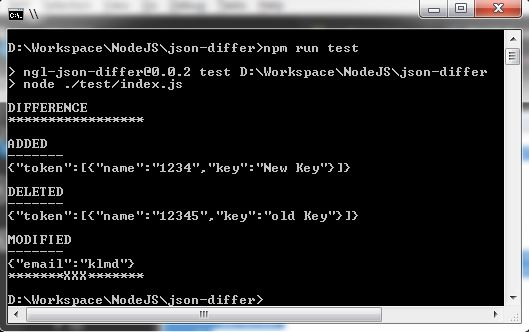

# ngl-json-differ
----------
Compares to JSON data and gives difference their difference added,modified,deleted

### Usage 
With this it is easy to identify the changes between different version json data. 

*e.g identify object changes in specific while versioning NO-SQL Data.*

## Installation

[npm i ngl-json-differ --save](https://www.npmjs.com/package/ngl-json-differ)

## Sample Code
```js
const differ = require("ngl-json-differ");


const difference = new differ.Differ({ name: "token", props: ["name"] }).getfullDifference(
    {
        email: "klmd",
        token: [
            { name: "123", key: "abc" },
            { name: "12345", key: "old Key" },
            { name: "1236", desc: "No token available" }
        ]
    },
    {
        email: "klm",
        token: [
            { name: "123", key: "abc" },
            { name: "1234", key: "New Key" },
            { name: "1236", desc: "No token available" }
        ]
    }
);
console.log("DIFFERENCE");
console.log("*****************");
for (const key in difference) {
    if (difference.hasOwnProperty(key)) {
        const element = difference[key];
        console.log("");
        console.log(key.toUpperCase());
        console.log("-------");
        console.log(JSON.stringify(element));
    }
}
console.log("******* XXX *******");
```

### Output


FOR ( **Angular** )
```typescript
import { Differ } from 'ngl-json-differ';

@Injectable()
export class DifferService extends Differ {
    
}
```
FOR ( **typescript** )
```typescript
import { Differ } from 'ngl-json-differ';

const differ=new Differ({ name: "token", props: ["name"] });

differ.getfullDifference(obja,objb);
```

